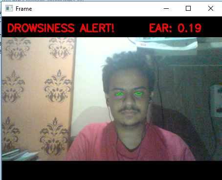

# Drowsiness detector
### We will require following modules to execute this program : 
scipy  
imutils  
threading  
numpy  
pyglet  
argparse  
time  
cv2  
dlib  
playsound  

### After installation implement - python drowsiness.py in your command shell

